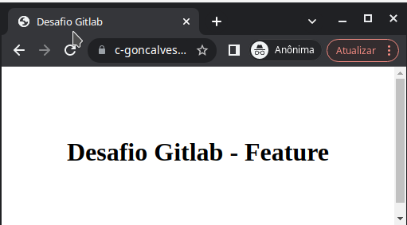

# Desafio GitLab

#### 1. Crie uma conta no Gitlab

**Resposta**

#### 2a. Crie um repositório público chamado "desafio-gitlab"

**Resposta**
Link:
[](https://gitlab.com/c-goncalves/desafio-gitlab)

#### b. Clone-o em seu computador.

**Resposta**

```console
git clone git@gitlab.com:c-goncalves/desafio-gitlab.git
```

#### 3. Adicione os arquivos do desafio ao seu repositório local faça o primeiro commit.

**Resposta**

```console
desafio-gitlab $ cp -r ../../getUP/formando-devops/desafio-gitlab/public/* .
desafio-gitlab $ ls -lha
desafio-gitlab $ git status
desafio-gitlab $ git add .
desafio-gitlab $ git commit -m "Arquivos Desafio GitLab"
```

#### 4. Faça o push do seu repositório local para o repositório remoto.
**Resposta**

```console
desafio-gitlab $git branch -a
desafio-gitlab $ git push -u origin main
```


#### 5. Mude o texto da página inicial para "Desafio GitLab - Dev".

**Resposta**

```console
desafio-gitlab $ vim index.html
desafio-gitlab $ git add .
desafio-gitlab $ git commit -m "Mudando pagina principal para Dev"
```


#### 6. Crie uma nova branch chamada "feature" e altere o texto da página inicial para "Desafio GitLab - Feature".

**Resposta**

```console
desafio-gitlab $ git branch feature main
desafio-gitlab $ git checkout feature
desafio-gitlab $ vim index.html 
```


#### 7. Crie um pipeline no GitLab CI para fazer o deploy do site estático no GitLab Pages.

**Resposta**

```console
desafio-gitlab $ vim .gitlab-ci.yml
desafio-gitlab $ git add .
desafio-gitlab $ git commit -m "Arquivo gitlab-ci"
desafio-gitlab $ git push --set-upstream origin feature 

```


#### 8. Faça o merge da branch "feature" para a branch "main".

**Resposta**


#### 9. Encontre o endereço do seu site no GitLab.

**Resposta**


#### 10. Acesse a página inicial do seu projeto no Gitlab e verifique se o texto foi alterado.

**Resposta**



#### 11. Adicione no arquivo [RESPOSTAS.md](RESPOSTAS.md) o link para o seu repositório e o log do git com o histórico de commits. Envie também um screenshot da Gitlab Page criada.

**Resposta**

```console
desafio-gitlab $ git log


commit fc52520443e462ab1f61e33aee3cfa4937452cb1 (HEAD -> main, origin/main)
Author: c-goncalves <carolinags@pm.me>
Date:   Thu Oct 13 00:34:25 2022 -0300

    Add public folder

commit 33e99c7cd1c651fedfa25b2095773a83ddb71a00
Merge: fe7f162 dfeefe5
Author: c-goncalves <carolinags@pm.me>
Date:   Thu Oct 13 03:21:34 2022 +0000

    Merge branch 'feature' into 'main'
    
    Feature
    
    See merge request c-goncalves/desafio-gitlab!1

commit dfeefe543d18251659e5787fc4a4b85e7cea7228 (origin/feature, feature)
Author: c-goncalves <carolinags@pm.me>
:...skipping...
commit fc52520443e462ab1f61e33aee3cfa4937452cb1 (HEAD -> main, origin/main)
Author: c-goncalves <carolinags@pm.me>
Date:   Thu Oct 13 00:34:25 2022 -0300

    Add public folder

commit 33e99c7cd1c651fedfa25b2095773a83ddb71a00
Merge: fe7f162 dfeefe5
Author: c-goncalves <carolinags@pm.me>
Date:   Thu Oct 13 03:21:34 2022 +0000

    Merge branch 'feature' into 'main'
    
    Feature
    
    See merge request c-goncalves/desafio-gitlab!1

commit dfeefe543d18251659e5787fc4a4b85e7cea7228 (origin/feature, feature)
Author: c-goncalves <carolinags@pm.me>
Date:   Thu Oct 13 00:13:39 2022 -0300

    Alteracao pagina inicial e adicionando file pipe

commit fe7f1629e90947191ff949a30809f8e159eec65b
Author: c-goncalves <carolinags@pm.me>
Date:   Wed Oct 12 23:56:36 2022 -0300

    Mudando pagina principal para Dev

commit 5ef17e0863fbf60cec2fc848d172aa64ed74cec6
Author: c-goncalves <carolinags@pm.me>
Date:   Wed Oct 12 23:50:18 2022 -0300

    Arquivos Desafio GitLab

```
